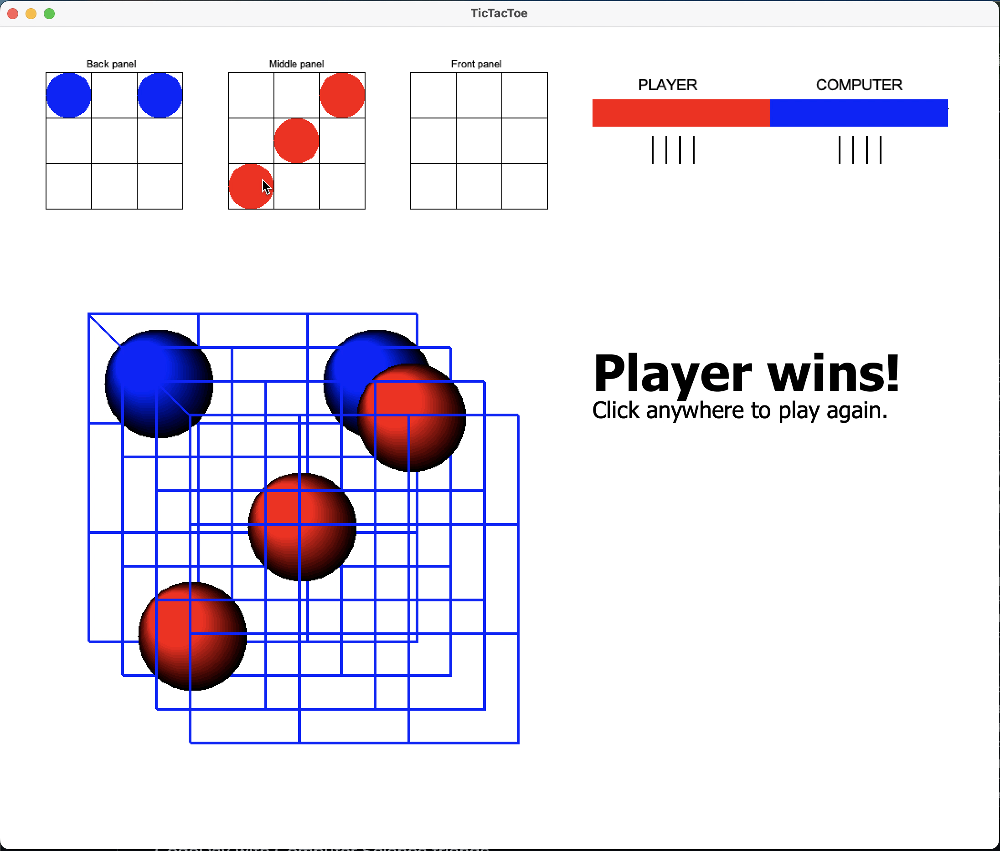
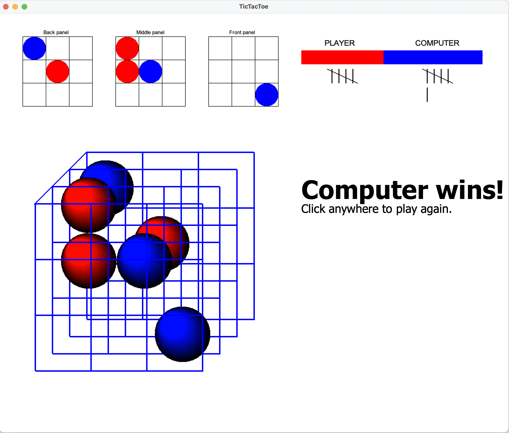

# Description

A 3D Tic-Tac-Toe game implemented in Java.

# Download and Run

### Option 1: Download and run the JAR (Fastest)
1. [Download the `3DTicTacToe.jar` file](https://github.com/21david/3D-TicTacToe/raw/master/3DTicTacToe.jar) from this repository.
   - Java (specifically a JRE - Java Runtime Environment) is needed to run this file. [Download it here](https://www.java.com/en/download) if necessary. (Note: Macs with Intel processors need the x86_64 version linked below the download button.)
2. **On macOS:**
   - Opening the JAR may show a warning that Apple could not verify that it is free of malware. This is expected for unsigned apps. You can safely allow it by following these steps.
     - Go to **System Settings > Privacy & Security > Security** and look for "3DTicTacToe.jar" and click "Open Anyway".
3. **On Windows:**
   - Double click the JAR file. If it doesn't run, make sure you have Java installed. You may need to right click and select **Open with > Java**.

### Option 2: Clone or Download the Repository
#### If you have Git:
  1. Clone the repository:
     ```sh
     git clone https://github.com/21david/3D-TicTacToe.git
     cd 3D-TicTacToe
     ```
#### If you don't have Git:
  1. Click the green **Code** button and select **Download ZIP** at the bottom of the pop-up.
  2. Unzip the file and open the folder.

#### Then compile and run the files.
1. Make sure you have a JDK installed (Java 8 or later, if not, see [these](https://www.freecodecamp.org/news/install-openjdk-free-java-multi-os-guide/?utm_source=chatgpt.com) or [these](https://www.geeksforgeeks.org/download-and-install-java-development-kit-jdk-on-windows-mac-and-linux/?utm_source=chatgpt.com) instructions).
2. Run these commands to comile and run:
   ```sh
   javac src/*.java -d bin
   java -cp bin Runner
   ```
Alternatively, load the `.java` files into any IDE that supports Java (for example Eclipse, VSCode, IntelliJ, or JCreator), then compile and run the files.

# How to Play
- Click any cell on any of the three panels to place your piece. The computer will immediately place its piece using AI.
- The first player to get three in a row (in any direction, including 3D diagonals) wins!

# Screenshots



# Technologies
- [**Java SE 8**](https://docs.oracle.com/javase/8/docs/api/)
    - [Java Swing package](https://docs.oracle.com/javase/8/docs/api/javax/swing/package-summary.html)
    - [Java AWT package](https://docs.oracle.com/javase/8/docs/api/java/awt/package-summary.html)


---

Feel free to fork and contribute!
